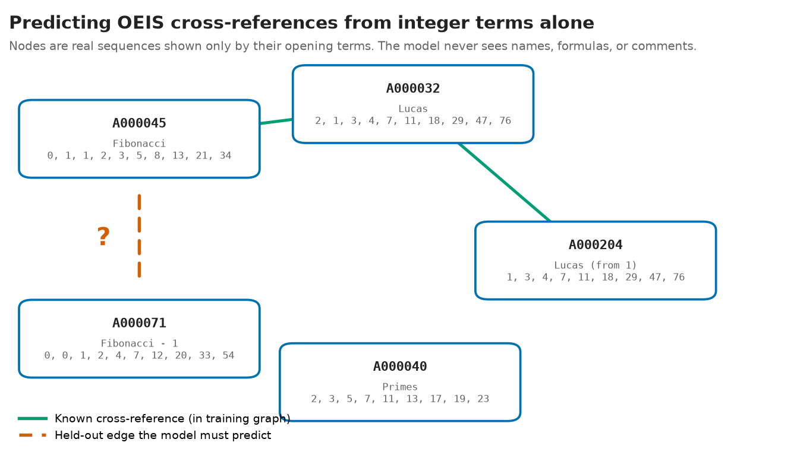

# OEIS Matchmaker

**Can a model that sees nothing but the raw integer terms of a sequence rediscover how
mathematicians decided two sequences are related?**

> **Status: results pending.** This repo ships a pre-registered, reproducible benchmark and
> its full construction pipeline. No model has been trained and nothing has been scored on the
> held-out split yet. The reusable artifact (the locked pre-registration plus the stratified
> benchmark) is described below; the headline numbers come later.

---

## The question

The [On-Line Encyclopedia of Integer Sequences](https://oeis.org) (OEIS) is a 60-year-old,
hand-curated catalog of ~396,000 integer sequences. Human editors connect related entries with
**cross-references**: "this sequence is the first differences of that one," "these two are
essentially the same," "this is the companion of that one." That web of links is one of
mathematics' great pieces of collective knowledge, and it was built by hand.

This project asks a sharp, falsifiable version of "could a machine have found those links?":
given **only the bare list of numbers** (no names, no formulas, no comments, no programs), can
a model rediscover the cross-reference graph? And can it surface plausible links the editors
*missed*, which then check out exactly on the full data?



*Each node is a real OEIS sequence shown only by its opening terms. Solid edges are
cross-references the model sees during training; the dashed edge is held out, and the model has to
recover it from the numbers alone. (Here, A000071 is just the Fibonacci numbers minus one, a
relationship that is invisible in the names but plain in the terms.)*

## How it works

The inputs are term-only, on purpose. Every sequence gets reduced to magnitude-robust features
of its integers: signed-log term profiles, growth-rate fits, finite-difference signatures,
residues mod small primes, parity and sign patterns. Names and prose are withheld, because the
point is to see what survives when you strip away everything a human editor would read.

From there it's a link-prediction problem. The human cross-reference graph is split into train,
validation, and test edges, and the model is scored on whether it ranks a sequence's true,
held-out partners near the top of its candidate list, which is a standard retrieval metric that
anyone can reuse. Not every edge is a fair target, though, so I stratify them into duplicates,
transforms, see-also families, and contextual links, and I only ask the headline question on the
strata that *could* be recovered from terms (duplicates and transforms). The rest are reported
descriptively rather than folded into the main claim.

Two more pieces keep it honest. The learned model has to beat a real classical baseline, an
OEIS-search-style method using shared n-grams plus an exact transform battery, not a strawman.
And when the model proposes a link the editors don't already have, that candidate gets checked
exactly on the full b-file data (hundreds of terms, exact arithmetic) under a frozen battery of
transforms, then de-duplicated against existing tools before I'd ever call it new.

## What makes it rigorous

The whole thing is pre-registered. Hypotheses, per-stratum thresholds, splits, and the full
analysis plan were committed to [`PRE_REGISTRATION.md`](PRE_REGISTRATION.md) (locked 2026-06-10)
before any model was trained or any test edge was read, and the split-drawing script literally
refuses to run until that lock is in place. All the data is public and pinned to an exact dated
snapshot (see [`data/README.md`](data/README.md)), so the headline number, when it lands, is
reproducible from scratch.

A null here would be a genuine result, not a failure. If terms alone can't recover the graph,
that tells you the cross-reference web encodes editorial knowledge living above the numbers
themselves, and the design is set up to report that plainly rather than bury it. The
relation-type labels are handled the same careful way: the classifier was frozen and then
checked against a fresh, blind hand-audit before I touched the data, and its known impurities
are disclosed and carried into the interpretation instead of being quietly patched after the
fact.

## Status

**Pre-registration locked; benchmark pipeline built and smoke-tested; model training is the next
stage.** No model has been trained and nothing has been evaluated on the test split yet. What
exists today is the full reproducible scaffold: the cross-reference edge list, the frozen
relation-type stratifier (blind-audit precision 92% / 76% / 100% / 96% across the four strata),
the pre-registered splits with negatives, the term-only feature extractors, the de-duplication
sets, and a passing test suite.

## What you can use today

Even before the model exists, this repo ships a self-contained, citable artifact: a
**pre-registered, stratified link-prediction benchmark over the OEIS cross-reference graph**.
It is:

- the **locked pre-registration** ([`PRE_REGISTRATION.md`](PRE_REGISTRATION.md)): hypotheses,
  per-stratum thresholds, splits, and analysis plan, committed before any test edge was read;
- the **frozen relation-type stratifier** ([`src/stratify.py`](src/stratify.py)) and its
  blind hand-audit, so anyone can see exactly how edges are sorted into the four strata;
- the **reproducible benchmark construction**: pinned data snapshot, seeded train/val/test
  splits with negatives, and a manifest of counts plus SHA256 hashes;
- the **task design figure** and the **term-only feature extractors** future encoders are
  scored against on equal footing.

The headline retrieval numbers are not in yet. The benchmark is the reusable thing; the model
result is the question it was built to answer.

## Reproduce / links

| What | Where |
|---|---|
| Locked claims + analysis plan | [`PRE_REGISTRATION.md`](PRE_REGISTRATION.md) |
| How to fetch every dataset (exact, pinned) | [`data/README.md`](data/README.md) |
| Prior work this builds on | [`docs/related_work.md`](docs/related_work.md) |
| Paper outline | [`docs/paper_outline.md`](docs/paper_outline.md) |
| The task figure above (generator) | [`src/figures/task_diagram.py`](src/figures/task_diagram.py) |

**Reproduce from scratch (one path).** Every stage is idempotent (re-running skips
finished work; pass `--force` to rebuild) and pinned to the 2026-06-10 snapshot in
[`data/README.md`](data/README.md). Raw data is fetched, never committed.

```bash
python -m venv .venv && . .venv/bin/activate
pip install -r requirements.txt

python -m src.build_graph     # fetch bulk dumps + clone oeisdata, build the %Y edge list + stats
python -m src.stratify        # frozen v1 relation-type labels on every pair
python -m src.dedup loda      # build the LODA known-relation exclusion set
python -m src.splits          # pre-registered train/val/test splits + negatives (REFUSES to run unless PRE_REGISTRATION.md is committed)
python -m src.smoke           # train-split-only pipeline sanity check (reads no held-out data)
python -m pytest -q           # stratifier / splits / features / dedup tests (36 tests)
python -m src.figures.task_diagram   # regenerate the task figure (deterministic, byte-stable)
```

Everything above is laptop-scale and CPU-only. The model-training and held-out
evaluation stages (the encoder, the strengthened baseline, and the per-stratum
top-10 recall numbers) are the *next* stage and are not yet committed; they run only
after the pre-registered evaluation begins.

**Pipeline modules**

| Module | Role |
|---|---|
| `src/fetch_data.py` | idempotent download of the pinned OEIS bulk dumps |
| `src/build_graph.py` | ingest the cross-reference (%Y) edge list + snapshot pin + corpus stats |
| `src/stratify.py` | frozen relation-type classifier (duplicate / transform / family / contextual) |
| `src/splits.py` | pre-registered train/val/test splits + negatives (refuses to run without the lock) |
| `src/features.py` | term-only feature extractors + classical-baseline primitives |
| `src/dedup.py` | known-relation exclusion sets from existing sequence-mining tools |
| `src/smoke.py` | tiny train-split-only pipeline check (no benchmark metric) |
| `tests/` | pytest suite for the stratifier, splits, features, dedup |

Regenerate the figure: `python -m src.figures.task_diagram`

**License:** code MIT (planned); released benchmark/data CC-BY-SA-4.0 with attribution
(inherited from OEIS).
